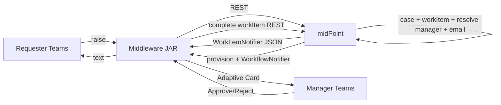

# Architecture & Enterprise Migration Plan

**Project:** MidPoint ⇄ Teams Approval Middleware
**Stack (pinned):** Java 21 · Spring Boot 3.3.12 · midPoint 4.10.3 · Maven
**Status:** Working integration → evolving to enterprise-grade (refactor, not rewrite).

---

## 1. Architectural principles (non-negotiable)

| System | Owns | Must NEVER |
|--------|------|-----------|
| **midPoint** | workflow, approval state, business rules, authorization, provisioning, notification triggering, audit | — |
| **Middleware (this JAR)** | event validation, translation, retry, idempotency, security, logging, metrics | own workflow state · decide approvals · hold business logic |
| **Teams bot** | user interaction, Adaptive Cards, UX | talk to midPoint directly · store approval state |

Flow: `Teams ⇅ Middleware ⇅ midPoint`. Teams never reaches midPoint directly. **All business notifications originate in midPoint** (`WorkItemNotifier` / `WorkflowNotifier` → middleware `/notify` → Teams). The middleware never invents a notification.



---

## 2. Current implementation (as-is inventory)

Single flat package `in.cnxy.connector` (Spring Boot). Teams bot is a **separate** Python FastAPI app (`../teams-bot`).

| File | Responsibility | Verdict |
|------|----------------|---------|
| `ApiController.java` | all `/api/v1/*` (requests, approve/reject, catalog, users/lookup, users/manager, revocations, notifications) | works; **god-controller** — DTOs + logic inline |
| `MidpointClient.java` | midPoint REST (assign/unassign, catalog, requestable, userProfile, managerOf, findOpenWorkItem, completeWorkItem) | works; the real integration adapter; no retry/circuit-breaker/timeout config |
| `NotifyController.java` | inbound `POST /notify` (midPoint→JAR), X-Api-Key, LRU dedupe | works; dedupe is in-memory |
| `BotNotifier.java` | forward normalized event → Teams bot | works; no retry/queue |
| `CatalogService.java` | `@Scheduled` requestable-catalog cache | works; volatile in-memory |
| `SecurityConfig.java` | Bearer filter (`/api/v1`), X-Api-Key skip for `/notify` | works; no HMAC/replay/nonce/rate-limit |
| `LocalConnectorConfiguration.java` | loads `configuration.toml` (tomlj) | works; secrets in file (not Vault) |
| `RequestResponseLogger.java` + `WebConfig.java` | structured request logging | works; no correlation-id propagation to midPoint |
| `StartupApiManifest.java` | logs endpoint contract | fine |

Current inbound/outbound endpoints: `GET /api/v1/access-catalog`, `/catalog/requestable`, `/catalog/orgs|applications|roles`, `/users/lookup`, `/users/manager`, `POST /requests/permanent|temporary`, `/requests/{email}/approve|reject|temporary-access`, `/revocations`, `/provisioning`, `/notifications/manager|user`, `POST /notify`.

---

## 3. Weaknesses / technical debt / missing enterprise features

**Architecture**
- God-controller (`ApiController`) mixes transport, validation, business orchestration, DTOs. No service/integration/mapper layering.
- No DTO↔domain separation; records double as API + logic models.
- No hexagonal ports/adapters — `MidpointClient` is both port and adapter.

**Resilience** — no Resilience4j (retry/circuit-breaker/timeout/bulkhead) on midPoint or Teams calls; no retry queue for `/notify` forwarding; dedupe + catalog are in-memory (lost on restart, not multi-instance).

**Security** — Bearer + X-Api-Key only. Missing: **HMAC signature** on `/notify`, replay protection (nonce + timestamp window), rate limiting, secret externalization to Vault, RBAC on management endpoints.

**Observability** — structured JSON logs exist, but no Micrometer/OpenTelemetry (actuator dependency is present), no Prometheus metrics, no distributed tracing, correlation-id not propagated across midPoint/Teams.

**Eventing** — no single **standard event contract**; `/notify` payload is ad-hoc. No event store/audit table. Only 2 event types wired (RAISED, COMPLETED); the target matrix needs ~15 (`APPROVAL_REMINDER`, `ESCALATED`, `PROVISION_STARTED/FAILED`, `EXPIRED`, `REVOKED`, …).

**Testing** — only `WorkItemPollerTest` (Mockito) exists. No integration/load/chaos/security tests.

**Data** — no Postgres/Redis; state is in-memory + the bot's SQLite.

---

## 4. Notifier blocker — RESOLVED via polling (midPoint notifier kept as optional fast path)

The event-driven design needs a signal when a work item is created or a case closes. midPoint's own
notifier never reliably POSTed to `/notify` (10.3 tests: `simpleWorkItemNotifier` not in schema,
`simpleCaseManagementNotifier` no runtime handler, `simpleWorkflowNotifier` valid but silent). The live
`systemConfiguration.backup.xml` has only the default SMTP notifier — the custom transport was never applied,
and its Groovy `java.net.http` call is likely denied by midPoint's script permission profile anyway.

**Fix:** `WorkItemPoller` polls `POST /ws/rest/cases/search` (`state = "open"`) every `connector.poll-seconds`
(default 15), diffs against the previous snapshot, and feeds new work items (`ACCESS_REQUEST_RAISED`, to the
assignee) and finished cases (`ACCESS_REQUEST_COMPLETED`, to the requester) into the existing `NotifyController`
pipeline. Events derive only from midPoint state, so ADR-0001 holds. If the midPoint notifier is ever made to
fire, both paths run and the shared dedupe (`caseOid|workItemId|status`) drops the duplicate.

Limits: snapshot is in-memory (cases opened/closed while the connector is down are missed); one DM per work item
(first approver). Tracked for the P10 event store.

Approval enforcement itself works: the JAR must submit as a **non-superuser** (`Service_Account`) — the
superuser bypasses approval (ADR-0002).

---

## 5. Target folder structure (evolve toward, incrementally)

```
in.cnxy.connector
├── controller/       # thin REST controllers (versioned)
├── service/          # orchestration (business-flow coordination, no biz rules)
├── integration/
│   ├── midpoint/     # MidpointClient (port) + adapter, retry/CB
│   └── teams/        # BotNotifier / Graph client, retry/CB
├── event/            # standard event contract + router + store
├── dto/              # API DTOs (request/response), immutable
├── mapper/           # MapStruct DTO↔domain
├── security/         # bearer, HMAC, replay, rate-limit
├── config/           # typed @ConfigurationProperties, beans
├── validation/       # request/payload validators
├── exception/        # global handler + typed exceptions
├── audit/            # event/audit persistence
├── metrics/          # Micrometer/OTel
└── scheduler/        # reminders/escalations (driven by midPoint, not invented)
```

Refactor **in place**, keep public API stable, one slice per phase.

---

## 6. Phased migration plan (each phase leaves the app working)

| Phase | Goal | Key changes | Gated by |
|------:|------|-------------|----------|
| **1** | Stabilize | pin Java 21 ✅, build green, `docs/` + `claude.md` ✅, add `spring-boot-starter-actuator` (fix `/actuator/health`) | — |
| **2** | Refactor architecture | extract `dto/` + `mapper/` (MapStruct), `service/` orchestration out of `ApiController`, `exception/` global handler, typed `@ConfigurationProperties`, constructor injection everywhere | — |
| **3** | Notification engine (unblocked by `WorkItemPoller`) | **standard event contract** (single extensible schema), `event/` router, persist events (audit), map midPoint payload → event → Teams; poller in place (§4) | — |
| **4** | Adaptive-card approval | card contract (requester/role/desc/priority/caseOid/workItemId), one-time buttons, "already processed" via midPoint work-item state (not local) | Phase 3 |
| **5** | Requester notifications | submitted/pending/approved/rejected — all midPoint-originated | Phase 3 |
| **6** | Provisioning notifications | started/completed/failed events | Phase 3 |
| **7** | Observability | Micrometer + OpenTelemetry + Prometheus, correlation-id propagation, health/metrics endpoints | — |
| **8** | Security hardening | HMAC on `/notify`, replay (nonce+timestamp), rate limiting, RBAC, secret externalization (Vault), TLS guidance | — |
| **9** | Testing | unit + integration (mock midPoint/Teams) + retry/chaos/security tests | after 2–8 |
| **10** | Production readiness | Postgres event store, Redis idempotency/retry (multi-instance), CI/CD, runbooks (install→rollback→DR), deployment manual | after 9 |

**Sequencing note:** Phases 2, 7, 8 don't depend on the notifier and can proceed now. Phases 3–6 (the event core) are **blocked by §4** — fixing midPoint's emission is the prerequisite.

---

## 7. Decisions (see `docs/DecisionLog.md`)
- **ADR-0001:** Teams is presentation-only; midPoint is the single source of truth; middleware never decides approvals. (This supersedes the earlier bot-driven `MANAGER_NOTIFY_MODE=bot` shortcut — retained only as a dev fallback, not for production.)
- **ADR-0002:** Middleware submits to midPoint as a **non-superuser** service account so approval is enforced (superuser bypasses it).
- **ADR-0003:** Evolve the existing connector; refactor over rewrite; app stays working each phase.
